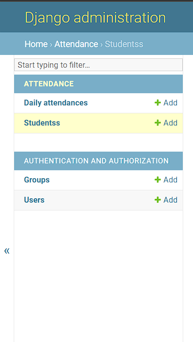

# How to Setup
Initial Setup
```shell
python -m venv venv
venv\Scripts\activate
pip install -r requirements
python manage.py migrate
python manage.py createsuperuser # enter all the detail to create admin user
```
For running the development Server
```shell
python manage.py runserver
```
## Add Data in the Database
- Goto ```https://localhost:8000/admin``` and login to the admin user using the admin username and password create in previous step
- goto Students under Attendance Section and add few data 

## Send Request to the server
- send image file to ```https://localhost:8000/```, you will get a json response it will be updated in the attendance table in the Database.
- use ```<input type='file' name='image' />``` ```name='image'``` to send the data to the server.

## Response for marking Attendance
- If the attendance is being marked for the first time.
```
{
    "name": "Aryan Amish",
    "reg_no": "40110122",
    "roll_no": "20S117896",
    "section": "A3",
    "dept": "CSE",
    "already_marked": false,
    "status": 200
}
```
- If the attendance is already marked as present for today.
````
{
    "name": "Aryan Amish",
    "reg_no": "40110122",
    "roll_no": "20S117896",
    "section": "A3",
    "dept": "CSE",
    "already_marked": true,     # it is set to true if it is already marked
    "status": 200
}
````
- If face didn't match
```
{
    "status": 404,
}
```